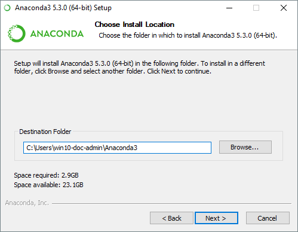
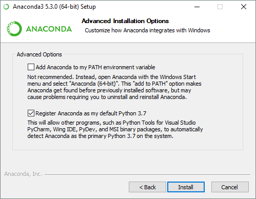
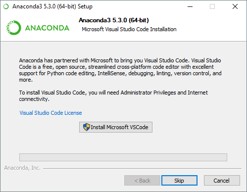

# Guia de instalação Anaconda3
Data: 24/07/2018
Versão: 0.1

### Pré-requisitos

1. Arquivo do instalador do Anaconda3 para Windows, disponível aqui:
https://repo.anaconda.com/archive/Anaconda3-5.2.0-Windows-x86_64.exe
2. Windows Vista ou superior.
3. 3GB de espaço em disco para o download e instalação.

## Instalação

* Para evitar erros de permissão, não execute o instalador a partir da pasta Favoritos.
* Recomendamos desabilitar o antivírus antes da instalação e habilitar após o término.

1. Duplo-clique no instalador.
2. Clique em Next.
3. Leia os termos de uso e clique em "I Agree".
4. Selecione uma pasta de destino

5. Marque as opções: "Add Anaconda to may PATH environment variable" e "Register Anaconda as my default Python 3.6". 

6. Clique em Install

7. Opcional: O instalador dá a opção de instalar o Microsoft VSCode Studio. Aceite apenas se deseja utilizar esse editor. Senão, clique em Skip.

8. Clique em Finish para fechar a janela do instalador.

...

