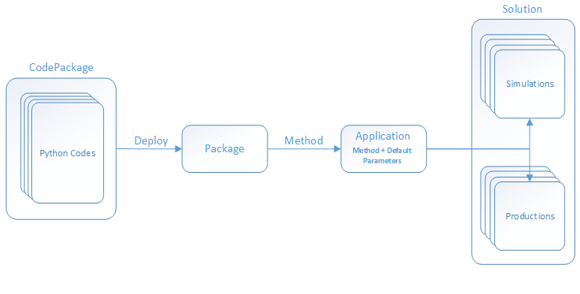
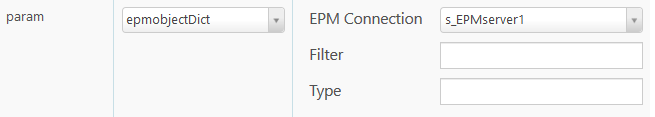

# Criando Algoritmos para o EPM Processor

*[Retornar ao menu](README.md)*

## Tópicos neste Capítulo

+ *[Leitura de Dados](EPMProcessorAlgoritmos.md#leitura-de-dados-de-data-objects)*

+ *[Escrita de Dados](EPMProcessorAlgoritmos.md#escrita-de-dados-em-uma-basic-variable)*

+ *[Resources](EPMProcessorAlgoritmos.md#acesso-aos-resources)*

+ *[Objetos do Elipse Data Model](EPMProcessorAlgoritmos.md#objetos-do-elipse-data-model-aplica-es-do-e3-ou-elipse-power-)*

+ *[Contexto de Execução](EPMProcessorAlgoritmos.md#contexto)*

## Introdução

Quando se deseja implementar um algoritmo para ser utilizado no **EPM Processor**, seja em produção ou simulação, este algoritmo deve ser codificado dentro de uma função em linguagem **Python** que, neste caso, é designada por **Application Method**, ou simplesmente de **Method** (*método*, em português).

> + O termo _método_ advém do paradadigma de programação orientada a objetos, onde se refere à uma função definida em uma classe específica.

Para que uma função seja apresentada como um método do **EPM Processor** nas configurações das **Applications**, é necessário que esta função seja identificada como tal. Isto é realizado através do uso de um *decorator*, a ser visto mais adiante.

> + _Decorator_ é um termo que designa um padrão de projeto de software que permite agregar dinamicamente funcionalidades adicionais a um dado objeto.

A imagem a seguir mostra o fluxo de criação e utilização de um método para aplicações no **EPM Processor**.



Existem duas bibliotecas que sempre devem ser importadas no código, uma do próprio **EPM Processor** e outra para acessar informações e dados de um **EPM Server**, conforme o código a seguir.

`import epmprocessor as epr`

`import epmwebapi as epm`

Estas bibliotecas proveem todas as funcionalidades utilizadas nos exemplos a seguir.

## O Decorator epr.applicationMethod

Este _decorator_ deve ser utilizado em todas as funções em linguaguem **Python** expostas como métodos para utilização nas **Applications**, como no exemplo a seguir.

```python
import epmprocessor as epr
import epmwebapi as epm

@epr.applicationMethod('MyMethod')
def my_method(session, param1, param2):
    '''Documentation'''

    ...
```

No exemplo anterior foi utilizado o parâmetro `session`. Este parâmetro deve sempre receber o tipo **session** na entrada de dados do método. Através deste parâmetro são acessíveis informações relativas ao evento, contexto de execução e informações sobre a última execução, entre outras.

O exemplo a seguir mostra o uso das propriedades `timeEvent` e `range` do parâmetro `session` para trabalhar com o período de uma consulta relativo ao momento em que o método é executado.

```python
import epmprocessor as epr
import epmwebapi as epm
import datetime

@epr.applicationMethod('MyMethod')
def my_method(session, param1, param2):

    endtime = session.timeEvent
    initime = endtime - datetime.timedelta(session.range)

    queryPeriod = epm.QueryPeriod(initime,endtime)

    pass
```

A tabela a seguir contém a descrição das propriedades do parâmetro `session`.

|Propriedade|Descrição|
|---|---|
|timeEvent|Data e hora do evento que gerou a execução do método. Pode ser informado manualmente em caso de teste, em tempo real no caso de uma **Production** ou simulado no caso de uma **Simulation**|
|range|Intervalo de tempo. Usualmente utilizado em conjunto com o parâmetro `timeEvent` para determinar as datas de início e término das consultas aos dados de processo|
|processInterval|Intervalo de tempo de processamento usado em consultas com agregação|
|parametersMap|Lista de parâmetros globais de uma **Application**, criados através da opção **New Session Parameter**|
|userCache|Memória de execução que pode ser usada para transferir informações entre uma execução e outra|
|lastExecutedInfo|Informações sobre a última execução|
|connections|Variável que contém todas as **Connections** utilizadas pelos parâmetros de um método que exigem conexões com um **EPM Server**|
|scopeContext|Contém informações sobre o contexto de execução, ou seja, se a avaliação do método está sendo realizada a partir de um teste, de uma execução em produção ou de uma simulação. Consulte o item [Contextos](EPMProcessorAlgoritmos.md#contexto-de-execução) para mais informações|

 > + Ao construir métodos, deve-se considerar que o número de parâmetros é fixo e configurado através do **Workbench**. Portanto, os métodos que utilizam o _decorator_ `epr.applicationMethod` não devem utilizar `args` ou `kwargs` na criação.

> + É possível criar parâmetros adicionais para o parâmetro `session` através da opção **New Session Parameter**. Esta opção está disponível na área **Test** do **Code Package**. Para efetivamente usar em **Solutions**, estes parâmetros adicionais devem ser configurados nas respectivas **Applications**.

## Parâmetros de um Método

A tabela a seguir contém os tipos de dados disponíveis para serem usados na entrada de parâmetros de métodos.

|Tipo de Dados|Descrição|
|---|---|
|**int**|Tipo de dados inteiro da linguagem **Python**|
|**intArray**|Sequência de inteiros, como por exemplo `[1, 3, 5, 6]`|
|**float**|Tipo de dados de ponto flutuante da linguagem **Python**|
|**floatArray**|Sequência de pontos flutuantes, como por exemplo `[1.0, 3.5, 5.0, 6.1]`|
|**string**|Tipo de dados de cadeia de caracteres da linguagem **Python**|
|**stringArray**|Sequência de cadeia de caracteres, como por exemplo `['abc','def','123']`|
|**bool**|Tipo de dados booleano da linguagem **Python**|
|**boolArray**|Sequência de booleanos, como por exemplo `[true, false, false]`|
|**dictionary**|Tipo de dados dicionario ordenado da linguagem **Python**|
|**datetime**|Tipo de dados de data e hora da linguagem **Python**. O **Workbench** ajuda a preencher este campo com a ferramenta de calendário|
|**datetimeArray**|Vetor de tipos de dados **datetime**. O **Workbench** ajuda a preencher este campo com a ferramenta de calendário|
|**session**|Tipo de dados exclusivo do **EPM Processor**. Recebe as propriedades **datetime**, **range** e **process**|
|**epmconnection**|Tipo de dados exclusivo do **EPM Processor**. Recebe uma das conexões configuradas em **EPM Connections**|
|**dataobject**|Tipo de dados exclusivo do **EPM Processor**. Recebe uma das conexões configuradas em **EPM Connections** e um nome de **dataobject**|
|**dataobjectArray**|Lista de tipos de dados **dataobjects**|
|**epmobjectDict**|Tipo de dados exclusivo do **EPM Processor**. Recebe um das conexões configuradas em **EPM Connections**, um filtro baseado no nome do objeto (os filtros não diferenciam maiúsculas e minúsculas) e um tipo de dados e monta um dicionário ordenado da linguagem **Python**|

Os tópicos a seguir apresentam exemplos de uso dos parâmetros de um método.

### Leitura de Dados de Data Objects

#### historyReadRaw()

Utilize este método para realizar consultas aos dados brutos (como foram armazenados) de um objeto de dados de um **EPM Server**, passando apenas o período de tempo da consulta como argumento. Para trabalhar com períodos de tempo, utilize a classe **QueryPeriod**.

O retorno deste método corresponde a um **array** do módulo **numpy** com o cabeçalho `Value`, `Timestamp` e `Quality`. Exemplo:

```python
import epmwebapi as epm
import datetime

@epr.applicationMethod('GetHistoryRaw')
def get_history_raw(session, epmdataobject):
    '''Get one hour raw historic data from epm dataobject'''

     endtime = session.timeEvent

     initime = endtime - datetime.timedelta(session.range)

     queryperiod = epm.QueryPeriod(initime, endtime)

    try:
        data = epmdataobject.historyReadRaw(queryperiod)
    except:
        raise Exception('Error reading raw data.')
```

> + Recomenda-se sempre colocar as consultas históricas dentro de um bloco `try/except` da linguagem **Python**.

#### historyReadAggregate()

Este método realiza consultas agregadas aos dados de processo conforme o padrão OPC UA. É preciso passar como parâmetro o período da consulta, o tipo de agregação e o intervalo da agregação. Neste caso utiliza-se, além da classe **QueryPeriod**, a classe **AggregateDetails**.

O retorno deste método corresponde a um **array** do módulo **numpy** com o cabeçalho `Value`, `Timestamp` e `Quality`. Exemplo:

```python
import epmwebapi as epm
import datetime

@epr.applicationMethod('GetHistoryInterpolative')
def get_history_interpolative(session, epmdataobject):
    '''Get interpolative data from epm dataobject'''

    endtime = session.timeEvent
    initime = endtime - datetime.timedelta(session.range)

    try:
        queryperiod = epm.QueryPeriod(initime,endtime)
        processInterval = datetime.timedelta(seconds=session.processInterval)
        aggregationdetails = epm.AggregateDetails(processInterval, epm.AggregateType.Interpolative)
        data = epmdataobject.historyReadAggregate(aggregationdetails,queryperiod)
    except:
        raise Exception('Error reading processed data.')

```
> + Recomenda-se sempre colocar as consultas históricas dentro de um bloco `try/except` da linguagem **Python**.

Consulte os tipos de agregações disponíveis no *[Apendice A: Agregações](Agregacoes.md)*.


### Escrita de Dados em uma Basic Variable

Existem dois métodos para escrita de dados em uma **Basic Variable** de um **EPM Server**, cada um servindo a uma situação.

+ **write**: Utiliza a via de tempo real do **EPM Server**. Deve ser utilizado quando se deseja escrever um valor único em uma **Basic Variable**. Para que o **dataobject** receba uma escrita através deste método é necessário que não exista vínculo da **Basic Variable** com um endereço do **Interface Server** e que estejam habilitadas as opções **Enable Real Time** e **Record** da **Basic Variable**.
+ **historyUpdate**: Utiliza a via de dados históricos do **EPM Server**. Utilizado para escrever uma sequência de valores em uma **Basic Variable**. Como argumento deve-se passar uma estrutura de dados do tipo **numpy array** como mostrada no exemplo a seguir.

```python
import numpy as np
array_format = np.dtype([('Value', '>f8'), ('Timestamp', 'object'), ('Quality', '>i4')])

```

Neste exemplo, a coluna **Value** foi definida para o tipo de dados **floating point** (`>f8`) da linguagem **Python**. Caso os dados sejam de outro tipo, é necessário adequar este parâmetro para o tipo de dados correspondente.
A coluna **Timestamp** deve sempre receber dados do tipo **datetime** da linguagem **Python**, e sempre em ordem cronológica natural, ou seja, dos mais antigos para os mais novos.
A coluna **Quality** deve corresponder a uma qualidade do padrão OPC UA. Para valores com qualidade boa, o valor correspondente é 0 (zero).

> + Evite a escrita de dados fora de ordem cronológica. Quando o **EPM Server** recebe um valor fora de sequência, precisa de processamento extra para inseri-lo no ponto correto.

#### basicvariable.write(data)

Exemplo de uso:

```python
import datetime

@epr.applicationMethod('Write')
def write(session, epmdataobject):
    '''Write one value in epmdataobject'''

    date = datetime.datetime.now()
    value = 100
    quality = 0 #zero is Good in OPC UA

    try:
        epmdataobject.write(value, date, quality)
    except:
        raise Exception('Error writing data.')
```

#### basicvariable.historyUpdate(data)

Neste exemplo também é verificado o contexto de execução do método, **Test**, **Simulation** ou **Production**. Consulte a documentação da biblioteca **epmprocessor** para mais informações.

```python
import epmprocessor as epr
import epmwebapi as epm
import numpy as np
import pandas as pd
import datetime

@epr.applicationMethod('HistoryUpdate')
def history_update(session, epmdataobject):
    '''Update epmdataobject with five itens'''

    #pandas generate a range of dates
    newdates = pd.date_range('1/1/2018', periods=5,freq='H' )

    #just a five itens list
    newvalues = [50,60,30,40,10]
    base = datetime.datetime(2018,1,1)
    newdates = np.array([base + datetime.timedelta(hours=i) for i in range(5)])

    # epm ndarray data format.
    desc = np.dtype([('Value', '>f8'), ('Timestamp', 'object'), ('Quality', '>i4')])
    datatemp = np.empty(len(newvalues), dtype=desc)

    #loop to populate the object before send to EPM
    i=0
    while i < len(newvalues):
        datatemp['Value'][i] = newvalues[i]
        datatemp['Timestamp'][i] = newdates[i]
        datatemp['Quality'][i] = 0
        i = i+1
    try:

        if session.scopeContext == epr.ScopeContext.Test:
            print('Resultado: {valor} - {timestamp}'.format(valor=str(datatemp['Value'][-1]),
                                                                timestamp=datatemp['Timestamp'][-1].isoformat()))
        else:  # Production ou Simulation
            epmdataobject.historyUpdate(datatemp)

    except:
        raise Exception('Error in historyUpdate')
```

## Acesso aos Resources

É possível acessar a estrutura de arquivos dos recursos do **EPM Webserver** através da API. São acessíveis tanto recursos do próprio **EPM Processor** como do **EPM Portal**. Para acessar os recursos, é necessário ter um parâmetro do tipo **epmconnection**. Para isto, utilize o código a seguir.

`resource_manager = epmconnection.getProcessorResourcesManager()`

Para recursos do **EPM Portal**, utilize o código a seguir.

`resource_manager = epmconnection.getPortalResourcesManager()`

### Exemplos

#### Download de Recursos

```python
@epr.applicationMethod('ResourceAccess')
def resource_access(session, epmconnection):
    '''Access resource from EPM Processor '''

    resource_manager = epmconnection.getProcessorResourcesManager()
    image_resource = resource_manager.getResource('folder/image.png')
    image = image_resource.download(epm.DownloadType.Binary)   

```

#### Upload de Imagem para uma Pasta do EPM Portal

```python
@epr.applicationMethod('UploadImage')
def upload_image(session, epmconnection, pathname):
    '''Upload matplotlib .png chart to EPM Portal resources folder '''

    some_data = [1,2,3,4,5]
    import matploptlib.pyplot as plt
    import io
    import mimetypes

    plt.plot(some_data)    
    buffer = io.BytesIO()    
    plt.savefig(buffer, format='png') #salva figura em buffer
    buffer.seek(0)

    resource_manager = epmconnection.getPortalResourcesManager()
    folder = resource_manager.getResource(pathname)

    #faz upload do buffer com o tipo .png
    resource = imgFolder.upload('image.png', buffer, 'matplotlib plot',
                                mimetypes.types_map['.png'], overrideFile=True)  
```

#### Apagando um Resource

```python
@epr.applicationMethod('Delete')
def delete_image(session, epmconnection):
    '''Delete EPM Portal resource'''  

    resource_manager = epmconnection.getPortalResourcesManager()    
    resource_manager.getResource(u'folder/image.png').delete()
```

## Objetos do Elipse Data Model (Aplicações do E3 ou Elipse Power)

O **Elipse DataModel** permite replicar a estrutura de dados dos sistemas SCADA da **Elipse Software** (**E3** ou **Elipse Power**). Uma vez que esta estrutura exista no **EPM Server**, é possível localizar e trabalhar com seus elementos no código.

Uma das formas de obter estes elementos é utilizando o tipo de dados **epmobjectDic** como parâmetro de entrada. Desta forma o filtro é realizado no **EPM Server** e o parâmetro contém um objeto do tipo de dados dicionário ordenado da linguagem **Python** com o resultado do filtro.



A tabela a seguir descreve as opções mostradas na imagem anterior.

|Opção|Descrição|
|---|---|
|**EPM Connection**|Uma das conexões configuradas em **EPM Connections**|
|**Filter**|Nome ou parte do nome do objeto. O filtro diferencia entre maiúsculas e minúsculas|
|**Type**|Tipo do objeto|

### Exemplo

```python

import epmwebapi as epm
import epmprocessor as epr
import datetime

@epr.applicationMethod('GetHistoryRaw')
def get_history_raw(session, obj_dict):
    '''Get one hour raw historic data from epm dataobject'''

    endtime = session.timeEvent

    initime = endtime - datetime.timedelta(session.range)

    queryperiod = epm.QueryPeriod(initime, endtime)

    for obj in obj_dict.values():
        print(obj.historyReadRaw(queryperiod))

    return epr.ScopeResult(True)   
```

## Contexto
Através de um parâmetro da `session` é possível verificar qual é o contexto em que o método está sendo executado.

+ **Test**: Quando é executado através da opção **Test** do **Code Package**
+ **Simulation**: Quando é executado a partir de uma **Simulation**
+ **Production**: Quando é executado a partir de uma **Production**

Pode ser interessante criar execuções diferenciadas para cada um dos casos. Por exemplo, em **Test** ou **Simulation** pode não ser
interessante escrever o resultado em variáveis do **EPM Server**, mas sim mostrar o resultado utilizando o método `print`.

```python
import epmprocessor as epr
import epmwebapi as epm

@epr.applicationMethod('ScopeContext')
def scope_context(session):

    if session.scopeContext == session.scopeContext.Test:
        #do it in test
        print('Test Context')

    if session.scopeContext == session.scopeContext.Simulation:
        #do it in simulation
        print('Simulation Context')

    if session.scopeContext == session.scopeContext.Production:
        #do it in production
        print('Production Context')

```

*[Próxima Seção: Suporte](EPMProcessorSuporte.md)*
