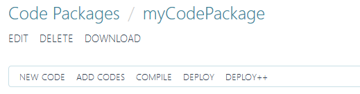
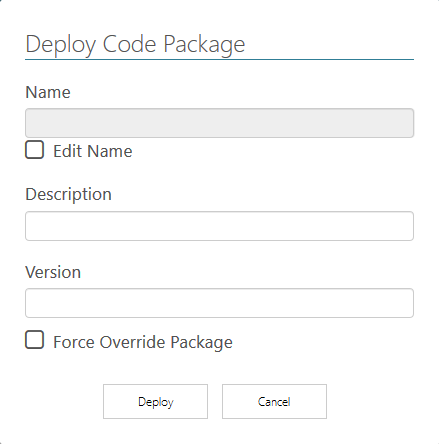

# Code Packages

*[Retornar ao menu](README.md)*

Um **Code Package** é um conjunto de códigos escritos em linguagem **Python** contendo as lógicas das instruções que podem ser utilizadas posteriormente nas aplicações. O **Code Package** deve ser empacotado através da operação de **Deploy** ou **Deploy++**, quando passa a ser denominado simplesmente de **Package**.

A área de visualização possui uma tabela com informações dos **Code Packages** já criados. A tabela a seguir contém a descrição das opções disponíveis.

|Opção|Descrição|
|:---:|---|
||Status da verificação de código|
||Permite editar o **Code Package**|
||Permite executar o _download_ do **Code Package**|
||Exclui o **Code Package**|

Dentro de um **Code Package** são realizados *uploads* e edições de códigos em linguagem **Python**, testes de métodos e utilização das opções de **Deploy**. Para criar um novo **Code Package**, siga estes procedimentos.

1. No menu lateral, selecione a opção **CODE PACKAGES**.
2. Na área que se abre, clique em **NEW**.
3. Digite um nome, uma descrição e a versão.
4. O **Code Package** recém-criado é aberto para edição.

> + O **EPM Processor** não realiza o controle de versão de código. O gerenciamento das diferentes versões de projeto, bem como a alteração do campo **Version** é responsabilidade da equipe de desenvolvimento.



As opções mostradas na figura anterior estão descritas na tabela a seguir.

|Opção|Descrição|
|---|---|
|**Edit**|Permite editar o nome, a descrição e a versão do **Code Package**|
|**Delete**|Exclui o **Code Package**|
|**Download**|Executa o _download_ do **Code Package** para a máquina local|
|**New Code**|Insere um novo algoritmo em linguagem **Python** no **Code Package**|
|**Add Codes**|Executa o _upload_ de arquivos ou pacotes comprimidos de código em linguagem **Python**|
|**Compile**|Verifica se existem erros de sintaxe nos códigos inseridos no **Code Package**|
|**Deploy**|Cria um novo **Code Package**|
|**Deploy++**|Cria um **Code Package** com otimização de performance e ofuscamento de código fonte|

> + Para mais informações sobre a diferença de desempenho entre os pacotes gerados pela operação de **Deploy** e **Deploy++**, consulte o tópico *[Deploy e Deploy++](EPMProcessorCodePackages.md#deploy-e-deploy-)*.

## Criando um Código Fonte

1. Clique em **NEW CODE**, digite um nome e uma descrição e clique em **Save**.
2. Clique no nome criado para abrir a edição do código fonte.
3. O editor de código com um exemplo mínimo é aberto, com as opções descritas na tabela a seguir.

|Opção|Descrição|
|:---:|---|
||Salva a última edição do algoritmo|
||Carrega a última versão salva|
||Executa o _upload_ de um código fonte e substitui o atual|
||Exclui o código fonte|
||Edita o nome e a descrição do código fonte|

## Editor

O **Workbench** contém um editor para pequenos ajustes rápidos e testes de código fonte. Recomenda-se a utilização de um editor ou IDE (*Integrated Development Environment* ou *Ambiente de Desenvolvimento Integrado*) próprio para o desenvolvimento de aplicações em linguagem **Python** e usar o recurso de importar o código fonte quando já estiver testado, validado e documentado.

O editor de código fonte do **EPM Processor** implementa os seguintes recursos:

+ Coloração de sintaxe
+ Autocompletar
+ Localizador
+ Edição em lote
+ Recolher e expandir blocos de código

A tabela a seguir contém os atalhos de teclado disponíveis no editor de código fonte do **EPM Processor**.

|Opção|Atalho de Teclado|
|---|---|
|**Salvar**|Ctrl + S|
|**Marcar Tudo**| Ctrl + A|
|**Voltar**|Ctrl + Z|
|**Avançar**|Ctrl + Y|
|**Edição em Lote**|Ctrl + Alt + K|
|**Selecionar Tudo**|Ctrl + A|
|**Ir para uma Linha Específica**|Ctrl + L|

## Testando um Código Fonte

1. Após editar o código fonte, clique em **Salvar**.
2. Clique em **Compile**.
3. Selecione o método a testar na opção **Method**.
4. Preencha cada campo com o tipo e valor compatíveis com o algoritmo.
5. Clique em **Test**.
6. Verifique o resultado.

## Criando um Método em Linguagem Python para Uso na Estrutura do EPM Processor

Um desenvolvedor de soluções para o **EPM Processor** pode utilizar quaisquer funções e bibliotecas da linguagem Python, desde que a saída ou resultado do código fonte seja compatível com uma execução como serviço, ou seja, sem interface visual.

Para que um método escrito em linguagem **Python** se torne uma tarefa executada pelo **EPM Processor**, este deve possuir a sintaxe a seguir.

   ```python
    import epmprocessor as epr

    @epr.applicationMethod('MethodName')
    def method_name(session, param1, param2=2):
        """dosctring para documentação"""
        ...
        ...
   ```

+ A primeira linha executa a instrução `import` da biblioteca **epmprocessor**.
+ A segunda linha utiliza um _decorator_ da biblioteca **epmprocessor**, que deve receber um parâmetro de tipo de dados **string**, que é o nome do método exposto na plataforma.
+ A terceira linha cria o método do usuário com os parâmetros de entrada necessários.
+ A quarta linha é a instrução `docstring` para documentação, que pode ser consultada posteriormente no **Workbench**. Consulte o tópico a seguir para mais informações.

## Documentação de Métodos

O **EPM Processor** analisa e integra na plataforma a instrução *docstring* de documentação dos métodos que utilizam o *decorator* **applicationMethod**. É recomendável realizar a documentação completa dos métodos para facilitar sua utilização.

Recomenda-se utilizar a sintaxe **reStructuredText**, padrão seguido na maioria dos projetos em linguagem **Python**. Desta forma, a ajuda dos métodos é apresentado com uma formatação adequada à leitura por parte dos usuários destes pacotes.

> + Ao criar uma *[Application](EPMProcessorApplications.md)*, é possível visualizar a documentação formatada caso seja adotada a sintaxe **reStructuredText**.

A sintaxe básica para a documentação está descrita a seguir.

    """ **Título do método**

    Descrição do método.
        :param1 : descrição do parâmetro
        :type param1: tipo de dado requerido pelo parâmetro
        :returns: descrição do retorno do método
        :rtype: tipo de dado de retorno do método
        :raises: em caso de exceções

    .. note::
        Nota de rodapé.

    .. todo::
        funções previstas mas ainda não implementadas no método.

    """

> + Para consultar a documentação completa, acesse a *[página oficial da sintaxe](http://docutils.sourceforge.net/rst.html)*.
> + Para mais informações sobre as bibliotecas e exemplos de desenvolvimento, consulte o capítulo *[Algoritmos](EPMProcessorAlgoritmos.md)*.

## Deploy e Deploy++

Após finalizar a criação dos algoritmos do **Code Package**, é necessário realizar o procedimento de empacotamento.

+ Criar um **Package** com **Deploy** mantém o código fonte legível, permitindo que o desenvolvedor entregue o código fonte aberto. Ideal para os casos onde se deseja que os usuários destes pacotes possam ter acesso ao código fonte, seja para uma maior compreensão dos algoritmos implementados, seja para eventuais manutenções ou expansões.

+ Criar um **Package** com **Deploy++** permite ao **EPM Processor** criar binários de alto desempenho. Neste caso o código fonte é convertido em binário utilizando o módulo **Cython**. Empacotamentos desta forma, além de maior desempenho nas execuções, ainda conferem uma maior segurança da codificação decorrente do próprio processo de compilação, além de proporcionar uma proteção da propriedade intelectual. Para sistemas em produção, recomendamos a utilização desse método.

> + Uma vez que o código fonte tenha passado pelo processo de **Deploy++**, é impossível recuperar o código fonte original. Recomenda-se adotar um sistema de controle de versão do código fonte, como por exemplo **Git**, **Mercurial** ou **SVN**, dentre outros.

Para realizar o empacotamento, siga estes procedimentos.

1. Clique em **Salvar** ou utilize o atalho de teclado Ctrl + S.
2. Clique em **Compile**.
3. Clique em **Deploy** ou **Deploy++**, dependendo do caso.



A tabela a seguir detalha as opções disponíveis na janela da figura a seguir.

|Opção|Descrição|
|---|---|
|**Name**|Nome do **Package** a ser criado. O padrão é manter o nome do **Code Package**|
|**Edit Name**|Esta opção deve ser marcada se a opção **Name** precisar ser editada|
|**Description**|Descrição do **Package**|
|**Version**|Versão do **Package**|
|**Force Override Package**|Sobrescreve um **Package** que já tenha sido criado com o mesmo nome|

Preencha os campos e clique em **Deploy** para finalizar o procedimento.

*[Próxima Seção: Packages](EPMProcessorPackages.md)*
