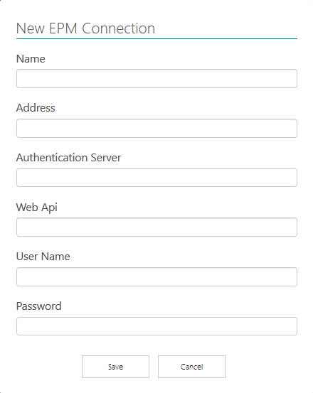

# EPM Connections

*[Retornar ao menu](README.md)*

Uma **EPM Connection** é uma configuração de conexão a um **EPM Webserver** que, por sua vez, está vinculado a um único **EPM Server**. Através desta conexão é possível o acesso aos seguintes itens de um **EPM Server**:

+ **Eventos** utilizados para disparar a execução automática de **Productions**
+ **Data Objects**, ou objetos de dados do **EPM Server**
+ **Estruturas de Dados**, ou seja, a organização hierárquica dos dados no **EPM Server** através de diretórios ou modelagem de objetos do **E3** ou **Elipse Power**

O **EPM Processor** permite múltiplas **EPM Connections**, seja para um mesmo servidor ou para servidores distintos. Para criar uma **EPM Connection**, siga estes procedimentos.

1. No menu lateral, clique em **EPM Connections**.
2. Clique em **NEW**.
3. Preencha os campos conforme as configurações desejadas e clique em **Save**.

As opções disponíveis nesta janela estão descritas na tabela a seguir.

|Opção|Descrição|
|---|---|
|**Name**|Nome da **EPM Connection**|
|**Address**|Nome ou endereço IP da máquina onde está instalado o **EPM Webserver**|
|**Authentication Server**|Endereço HTTP da máquina onde está instalado o **EPM Webserver**, seguido da porta TCP/IP configurada na opção **Authentication Port** da configuração do **EPM Webserver** (a porta TCP/IP padrão é a 44333), como por exemplo `http://nome_maquina:44333`|
|**Web Api**|Endereço HTTP da máquina onde está instalado o **EPM Webserver**, seguido da porta TCP/IP configurada na opção **Web Api Port** da configuração do **EPM Webserver** (a porta TCP/IP padrão é a 44332), como por exemplo `http://nome_maquina:44332`|
|**User Name**|Nome do usuário|
|**Password**|Senha do usuário|

*[Próxima Seção: Resources](EPMProcessorResources.md)*
