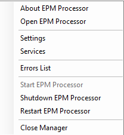

# Instalação

*[Retornar ao menu](README.md)*

## Pré-requisitos

+ **Windows 7 SP1** ou superior x64
+ **Windows Server 2008 R2 SP1** ou superior
+ **Framework .NET** 4.7.2 ou superior
+ **EPM Server** 3.12 ou superior
+ **EPM Webserver** 4.0 ou superior. Consulte o tópico *[Instalação](EPMWebserver.md)* para mais informações
+ Navegadores **Firefox** ou **Chrome**
+ **Python 3.7 x64, baixado do site python.org, instalado com a opção *Install for all users* e inserido no PATH do Windows**. 
(Não recomendamos a utilização de distribuições Python diferentes da oficial (python.org). Distribuições como Anaconda ou a versão da Windows Store, podem alterar o caminho padrão de alguns arquivos, causando o não funcionamento do EPM Processor.)

  + Instalação do interpretador do *[Python](Python.md)*
  + As bibliotecas são instaladas automaticamente via **Pypi**. Se a máquina estiver *offline*,
  instale manualmente. Consulte o tópico *[Perguntas Frequentes](EPMProcessorSuporte.md#perguntas-frequentes)* para mais informações
+ 1.5 GB de espaço em disco para _download_ e instalação

## Hardware

O _hardware_ necessário para o **EPM Processor** depende da complexidade das tarefas e do número de execuções, e deve ser pensado para os períodos de pico de utilização. Considere aumentar a capacidade quando perceber que o tempo de execução dos algoritmos está impactando de forma negativa na solução.

> + As configurações de produto têm influência na capacidade de processamento. Verifique as opções com o setor comercial da **Elipse Software**.

## Download

Execute o _download_ no site da **Elipse Software**, na seção do produto *[Elipse Plant Manager](https://www.elipse.com.br/produto/elipse-plant-manager/)*.

## Interpretador Python

O **EPM Processor** necessita de uma versão 3.6 x64 ou superior do interpretador **Python** padrão (**CPython**). Recomenda-se os seguintes cuidados:

+ Em ambientes de desenvolvimento, instale a distribuição *[Anaconda](Anaconda.md)*, pois esta distribuição possui todas as principais bibliotecas para projetos de ciência de dados.
+ Em ambientes de produção, instale o interpretador disponível em *[Python.org](https://www.python.org/)* e instale somente as bibliotecas utilizadas no projeto.

## Instalação

1. Certifique-se de que o ambiente atende os requisito listados anteriormente.
2. Se houver alguma execução do **Python** em andamento, termine-a.
3. Execute o instalador do **EPM Processor** em modo **Administrador**. Clique com o botão direito do mouse no arquivo `epmprocessor-enu.exe` e selecione a opção **Executar como Administrador**.
4. Aceite os termos de utilização do produto.
5. Selecione o diretório de instalação do **EPM Processor**.
5. Selecione o diretório de instalação do **MongoDB**.
6. Informe ao instalador o diretório de instalação do **Python**.
7. Mantenha a opção relacionada ao IIS ativada, para que o instalador configure automaticamente o webserver. Caso opte por utilizar outro webserver (Apache, Nginx), é preciso configurá-lo manualmente.

> + Todos os registros e configurações do **EPM Processor** são salvos no **MongoDB**. Execute _backups_ periódicos para evitar a perda da aplicação em caso de problemas físicos no servidor ou erros de procedimento com arquivos, tais como exclusões, alterações, etc.

### Instalação em Ambientes Virtualizados

Informe ao setor comercial da **Elipse Software** sempre que estiver utilizando ambientes virtualizados, redundância de VM (HA ou FT) ou caso os servidores não possuam uma porta USB. A **Elipse Software** fornece uma chave de produto especial para estes casos.

## Upgrade de Versão

Recomenda-se manter a versão sempre atualizada. Empresas que aderem ao programa **Elipse Care** têm direito a _upgrade_ gratuito da chave de produto.
Antes de instalar uma versão superior, verifique se a chave de produto está apta a receber esta versão.

Antes de instalar uma nova versão, execute a desinstalação da versão anterior via Painel de Controle do Windows.

> + Não exclua nenhuma pasta do diretório de instalação do **EPM Processor** manualmente. Esta operação pode acarretar em perda das configurações.

Execute o procedimento de _upgrade_ de forma planejada, pois durante este processo nenhuma **Solution** pode ser executada.

## Backups e restaurações

É recomendável realizar backups periódicos do sistema. O EPM Processor dispõe de uma ferramenta CLI (linha de comando) para backup e restauração de todos os itens do EPM Processor.
Acesse a ferramenta no diretório: %PROGRAMFILES64%\Elipse Software\EpmProcessor\Tools\Backup

1-	Para gerar o backup, execute via prompt de comando, alterando para o diretório escolhido:
$ epmprocbackup.exe --backup “i:\temp”

2-	Para fazer a restauração, alterando para o diretório onde se encontra o arquivo .bpr:
$ epmprocbackup.exe --restore “i:\temp\EpmProcBackup_201908081500.bpr”

3-	Para ajuda nos commandos:
$ epmprocbackup.exe --help

## Desinstalação

Execute a desinstalação do **EPM Processor** via Painel de Controle do Windows.

## EPM Processor Manager

O **EPM Processor Manager** é a interface de gerenciamento das conexões, portas, etc. Para abrir o menu de configurações, clique com o botão direito do mouse no ícone do **EPM Processor Manager** na Área de Notificações do Windows, conforme a figura a seguir.

As opções disponíveis no menu contextual da figura anterior estão descritas na tabela a seguir.

|Opção|Descrição|
|---|---|
|**About EPM Processor**|Abre uma janela com informações de versão e *copyright*|
|**Open EPM Processor**|Abre o endereço `http://localhost:porta` no navegador padrão do sistema operacional|
|**Settings**|Abre a janela de configuração|
|**Diagnostic**|Abre uma janela para visualização de informações sobre o funcionamento do **EPM Processor**|
|**Errors List**|Abre uma janela para visualização de erros em serviços e permissões|
|**Start EPM Processor**|Inicia os serviços do **EPM Processor**|
|**Shutdown EPM Processor**|Para os serviços do **EPM Processor**|
|**Restart EPM Processor**|Reinicia os serviços do **EPM Processor**|
|**Close Manager**|Fecha o **EPM Processor Manager**|

### Configurações

Para abrir as configurações do **EPM Processor Manager**, selecione a opção *Settings* do menu contextual.

As opções disponíveis na aba **General** estão descritas na tabela a seguir.

|Campo|Descrição|
|---|---|
|**Master User Admin**|Usuário do **EPM** *Master*|
|**Master User Admin Password**|Senha do **EPM** *Master*|
|**Authentication Port**|Porta TCP/IP do serviço de autenticação do **EPM Webserver**. Deve ser utilizada a mesma porta TCP/IP configurada no **EPM Webserver**. O valor padrão para esta opção é a porta TCP/IP 44333|
|**Web Api Port**|Porta TCP/IP da API do **EPM Webserver**. Deve ser utilizada a mesma porta TCP/IP configurada no **EPM Webserver**. O valor padrão para esta opção é a porta TCP/IP 44332|
|**EPM Processor Workbench**|Porta TCP/IP para acesso ao **Workbench**. Esta porta TCP/IP deve ser usada para acesso ao **Workbench** via navegador. O valor padrão para esta opção é a porta TCP/IP 44338|

As opções disponíveis na aba **EPM Master** estão descritas na tabela a seguir.

|Campo|Descrição|
|---|---|
|**EPM Python Engine**|Porta TCP/IP para acesso ao serviço **Python Engine**. *Esta opção não deve ser alterada por motivos não explícitos*|
|**EPM Processor Engine**|Porta TCP/IP para acesso ao serviço **Processor Engine**. *Esta opção não deve ser alterada por motivos não explícitos*|

As opções disponíveis na aba **Manager** estão descritas na tabela a seguir.

|Campo|Descrição|
|---|---|
|**Send an email**|Habilita o envio de e-mails para o caso de erros na execução do **EPM Processor**|
|**SMTP Server**|Endereço do servidor SMTP (*Simple Mail Transfer Protocol*)|
|**User**|Nome de usuário da conta de e-mail|
|**Password**|Senha da conta de e-mail|
|**Port**|Porta TCP/IP do servidor SMTP|
|**SSL**|Indica se o servidor SMTP utiliza SSL (*Secure Sockets Layer*)|
|**From**|Endereço de e-mail do remetente. Aceita apenas um remetente|
|**To**|Endereço de e-mail do destinatário. Aceita múltiplos destinatários, separados por ";"|

> + Se a opção **Send an email** estiver selecionada e acontecer alguma falha ativa, um e-mail é enviado 10 minutos após a inicialização do **EPM Processor Manager**. Uma nova verificação e envio são realizados a cada 24 horas. Em caso de falha no envio do e-mail, mais três tentativas são realizadas em um intervalo de 10 minutos.

### Diagnósticos

Para abrir a visualização do diagnóstico do **EPM Processor**, selecione a opção **Diagnostic** no menu contextual. As opções disponíveis nesta janela estão descritas na tabela a seguir.

|Menu|Descrição|
|---|---|
|**Windows Services - General**|Informações sobre o funcionamento dos serviços relativos ao **EPM Processor**|
|**Python - General**|Informações sobre a instalação do **Python** utilizada pelo **EPM Processor**|
|**Python - Modules**|Módulos **Python** instalados. Clique em **Export requirement** para gerar um arquivo `Requirements.txt`|
|**Python - EPM Modules**|Informações sobre os módulos **Python** do **EPM** instalados|
|**EPM Packages - General**|**Code Packages** de usuário disponíveis no **EPM Processor**|

*[Próxima Seção: Workbench](EPMProcessorWorkbench.md)*
