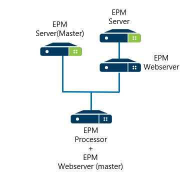

## Introdução

[Retornar ao menu](menu.md)

### Sobre
O **EPM Processor** é um módulo que se integra à plataforma **Elipse Plant Manager** (EPM).  Através desta plataforma é possível 
coletar dados de diversas origens, armazená-los e contextualizá-los, oferecendo alto desempenho de gravação e consulta, além de inúmeras 
ferramentas para visualização e análises afim de agilizar o processo de extração de conhecimento e no balizamento de tomadas de decisões.

O **EPM Processor** atua neste cenário possibilitando que algoritmos escritos em linguagem Python sejam colocados em execução 
automatizada ou sob demanda. As execuções automáticas são baseadas em eventos e disponibilizam conexão nativa aos dados de processo de 
um ou mais **EPM Servers**. Alguns casos típicos de uso desta ferramenta são cálculos de indicadores de desempenho, inferências sobre 
variáveis de processo, cálculos de previsões de demandas, geração de relatórios e documentações automáticas ou sob demanda, dentre outras.

Com essa ferramenta é possível gerenciar toda a geração de informações baseadas nos dados de processo, incorporando, ou não, 
informações de outras fontes de dados, tudo em um ambiente seguro e de fácil manutenção, requisitos vitais para a gestão das informações do negócio.

### Chave de Produto

Existem 4 configurações deste módulo:

| Configuração  | Processos  | Productions Simultâneas  |
|---|---|---|
| EPM Processor Demo|4+|10|
| EPM Processor Lite  |1  |  100 |
| EPM Processor Enterprise  | 4  | 1000   |
| EPM Processor Full  | 4+  | 1000+  |
 
* Processos - Processos do interpretador Python em execução no sistema operacional.
* Productions - Cada **Production** corresponde a uma aplicação configurada para execução automática segundo eventos produzidos em tempo real.
* No caso do **EPM Server** definido como *Master* estar rodando em modo de demonstração (Demo), o **EPM Processor** irá 
automaticamente entrar em modo de demonstração (Demo) também. 

É importante ressaltar que, uma vez escolhido o tipo de configuração do módulo, todas as chaves de EPM Processor adquiridas 
corresponderão a este mesmo tipo. Por exemplo, é possível adquirir três chaves do módulo **EPM Processor** para o tipo *Lite* de 
configuração, ao ser adquirida uma quarta chave, esta necessariamente também corresponderá ao tipo *Lite*, a não ser que seja feito 
o *upgrade* de tipo, quando todas as chaves passarão a corresponder ao novo tipo de configuração.

As chaves do módulo **EPM Processor** são contabilizadas no momento em que um **EPM Processor** se registra e estabelece uma 
conexão com um **EPM Server** definido como *Master* que, por sua vez, irá verificar nas suas configurações de produto, quantos 
módulos de **EPM Processor** aceita e estão disponíveis naquele momento. No caso de não ter mais chaves de **EPM Processor** disponíveis, 
os módulos do **EPM Processor** que tentarem se conectar ao **EPM Server** definido como *Master* terão sua conexão negada.

A partir da versão 3.06 do sistema EPM, o **EPM Processor** possui uma versão para avaliação, ou seja, uma chave para o modo 
Demo. O primeiro **EPM Processor** que se registrar e tentar estabelecer uma conexão com o **EPM Server** definido como *Master* 
será aceito, porém irá operar em modo de demonstração (Demo). Desta forma é possível avaliar os benefícios que o **EPM Processor** 
pode trazer para um ambiente onde já se tenha um **EPM Server**  em operação.

Para mais informações entre em contato com o setor comercial da [Elipse Software](wwww.elipse.com.br).

### EPM *Master*

O **EPM Processor** pode receber dados de diversos **EPM Server**. Nesse caso, deverá ser escolhido um **EPM Server** para ser o *Master* do **EPM Processor**. 
Este será o responsável pelas chaves do produto e autênticação de usuários.

Outra opção é ter vários **EPM Processor** para um único **EPM Server**. Neste caso o **EPM Server** deverá ter as chaves para a número de **EPM Processors** instalados.

 

[Próxima seção - Instalação](EPMProcessorInstalacao.md)
