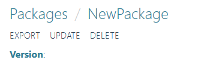

# Packages

*[Retornar ao menu](README.md)*

Um **Package** é um conjunto de algoritmos que passou pelo processo de **Deploy** ou **Deploy++**. Esse procedimento é realizado em *[Code Packages](EPMProcessorCodePackages.md)*.

Para acessar a visualização de **Packages**, clique em **Packages** no menu lateral. A opção **IMPORT**, mostrada na figura a seguir, permite que se realize o *upload* de **Packages** previamente exportados para arquivos em formato **JSON**.

A tabela a seguir mostra a função de cada uma das opções da tabela de visualização de **Packages**.

|Opção|Descrição|
|:---:|---|
||Abre a visualização do **Package**|
||Exporta o **Package** no formato **JSON**|
||Exclui o **Package**|

Para visualizar um **Package** específico, clique em  para abrir uma tabela com os métodos e seus respectivos parâmetros do **Package**, conforme a figura a seguir.

Os menus mostrados na figura a seguir estão descritos na tabela a seguir.

|Menu|Descrição|
|---|---|
|**Export**|Exporta o **Package** em formato **JSON**|
|**Update**|Executa o *upload* de um **Package** previamente exportado e atualiza o atual|
|**Delete**|Exclui o **Package**|

*[Próxima Seção: Applications](EPMProcessorApplications.md)*
