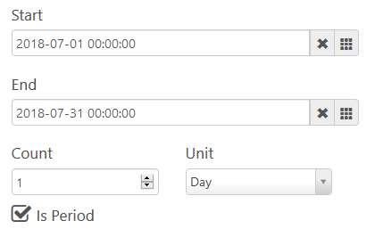
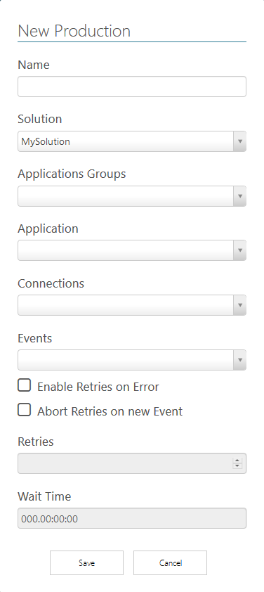

# Solutions

*[Retornar ao menu](README.md)*

As **Solutions** são agrupamentos que servem para organizar as soluções implementadas sobre aplicações, que podem ser colocadas em produção (eventos em tempo real) ou simuladas (eventos simulados e execução sob demanda). Desta forma, para melhor gerenciar as execuções, as **Solutions** são divididas em dois grupos:

+ **Simulation**: São gerados eventos simulados e a aplicação pode ser executada em diferentes períodos de tempo, como por exemplo executar uma aplicação para cada um dos últimos 12 meses.

+ **Production**: Os eventos que iniciam a execução de uma aplicação são gerados em tempo real a partir de um **EPM Server**, como por exemplo um método que executa todo primeiro dia do mês às 00:01.

A criação e configuração dos eventos de um **EPM Server** é realizada, monitorada e gerenciada a partir do **EPM Studio**. Consulte o tópico **EPM Events** do **Manual do Usuário do EPM** para mais informações.

Para visualizar e criar novas **Solutions**, clique em **Solutions** no menu lateral para mostrar as opções descritas na tabela a seguir.

|Opção|Descrição|
|:---:|---|
||Edita uma **Solution**|
||Cria uma cópia da **Solution** com um nome diferente|
||Exclui uma **Solution**|

Para criar uma nova **Solution**, siga estes procedimentos.

1. Clique em **New**.
2. Digite um nome e uma descrição para a **Solution**.
3. Para editar a **Solution**, clique em .

As opções de edição de uma **Solution** são **Edit**, **Delete** e **Permissions**. Estas opções são as mesmas de uma **Application**.

Também são mostradas as opções **New** e **View All** para **Simulations** e **Productions**. Através destas opções é possível, respectivamente, criar novas **Simulations** e **Productions** ou visualizar as **Simulations** e **Productions** disponíveis.

## Criando Simulations

Para criar uma nova **Simulation**, clique em **New** para abrir a janela da figura a seguir.

A tabela a seguir descreve as opções da janela anterior.

|Opção| Descrição|
|---|---|
|**Name**|Nome da **Simulation**|
|**Solution**|Indica a qual **Solution** esta **Simulation** deve pertencer|
|**Application Groups**|Indica em qual **Application Group** se encontra a **Application** requerida|
|**Application**|Indica qual **Application** deve ser colocada nesta **Simulation**|
|**Start**|Data e hora de início da simulação|
|**End**|Data e hora de término da simulação|
|**Count**|Intervalo de execução|
|**Unit**|Unidade do intervalo de execução definido na opção **Count**|
|**Is Period**|Se esta opção estiver selecionada, executa o método somente em datas e horas específicas definidas nas opções a seguir|
|**Select Date and Time**|Seleciona uma data e hora no calendário|
|**Add to Dates**|Inclui a data e hora selecionada na sequência de execuções|
|**Execute in Dates**|Data e hora em que a simulação é executada|

### Exemplo de Configuração

 

 Na configuração da figura anterior são gerados 30 eventos, pois o intervalo é de 30 dias e a unidade e contagem é de 1 (um) dia. Para esta configuração, execute os procedimentos a seguir.

1. Clique em **Save**.
2. Na lista de **Simulations**, clique em  para abrir a visualização.
3. Clique em **Execute** para iniciar a execução do método.
4. Aguarde o término da execução para visualizar o resultado.

## Criando Productions

Para criar uma nova **Production**, clique em **New** na visualização de **Productions**, conforme a figura a seguir.

A tabela a seguir descreve as opções da figura anterior.

|Opção| Descrição|
|---|---|
|**Name**|Nome da **Production**|
|**Solution**|Indica a qual **Solution** esta **Production** deve pertencer|
|**Application Groups**|Indica em qual **Application Group** se encontra a **Application** requerida|
|**Application**|Indica qual **Application** deve ser colocada nesta **Production**|
|**Connections**|Indica a **Connection** com o **EPM Server** da qual se deseja utilizar o evento|
|**Events**|Nome do evento utilizado para disparar a execução do algoritmo|
|**Enable Retries on Errors**|Se esta opção estiver selecionada, as retentativas de execução em caso de erro são habilitadas|
|**Abort Retries on new Event**|Se esta opção estiver selecionada, retentativas da execução anterior caso um evento novo ocorra não são executadas|
|**Retries**|Número de retentativas em caso de erro|
|**Wait Time**|Intervalo de tempo entre as retentativas|

Preencha os campos conforme a necessidade e clique em **Save**.

### Visualizando e Editando Productions

Para visualizar e editar **Productions**, clique em **Solutions** no menu lateral e clique em  para abrir uma **Solution**. Na seção **Productions**, clique em **View All**. A tabela a seguir contém a descrição das opções disponíveis para **Productions**.

|Opção|Descrição|
|:---:|---|
||Abre a visualização e edição da **Production** selecionada|
||Cria uma cópia da **Production** selecionada com um nome diferente|
||Exclui a **Production** selecionada|
||Inicia ou para a execução da **Production** selecionada|

Para abrir a visualização de uma **Production**, clique em . A janela de visualização contém as abas a seguir:

+ **Results**: Visualização do resultado da execução da **Production**. Filtre por data para localizar o resultado de execuções.
+ **App Config**: Edição da **Production** em relação à **Application**. É possível alterar os valores padrão inseridos na configuração da **Application**.
+ **Execution Config**: Permite alterar o evento que dispara a execução da **Production** e configurar as retentativas em caso de erro.
+ **Statistics**: Mostra as estatísticas gerais de execução. Consulte a tabela a seguir para mais informações.

|Opção|Descrição|
|---|----|
|**Min Exec. Time**|Menor tempo de execução do método|
|**Max Exec. Time**|Maior tempo de execução do método|
|**Average Exec. Time**|Média do tempo de execução dos métodos|
|**Standard Deviation Exec. Time**|Desvio padrão do tempo de execução dos métodos|
|**Total Executions**|Quantidade total de execuções|
|**Total Fails**|Quantidade total de execuções com falha|
|**Retries Count**|Quantidade total de retentativas|
|**Status Last Execution**|Status da última execução|
|**Last State Change**|Última alteração na configuração|

*[Próxima Seção: Algoritmos](EPMProcessorAlgoritmos.md)*
