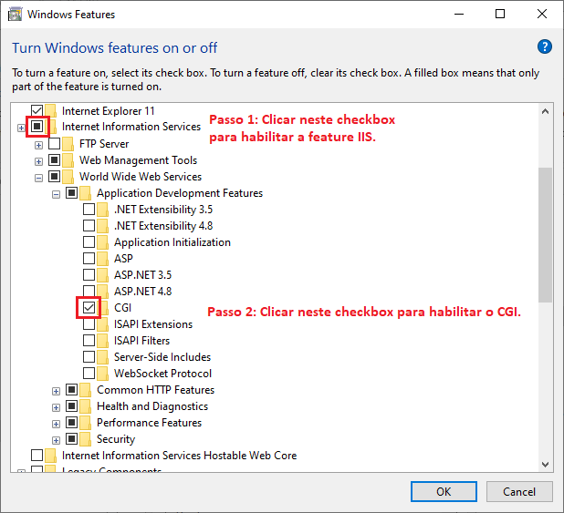

# Suporte

*[Retornar ao menu](README.md)*

## Perguntas Frequentes

### Posso utilizar o EPM Processor em modo Demo?

Sim. Consulte o capítulo *[Introdução](EPMProcessorIntroducao.md#chave-de-produto)* para mais informações.

### Quanto custa o EPM Processor?

Existem diversas configurações e soluções. Entre com contato com o setor comercial da **Elipse Software** para receber um orçamento adequado para a sua necessidade.

### Qual é o hardware necessário para executar o EPM Processor?

Consulte o capítulo *[Instalação](EPMProcessorInstalacao.md#hardware)* para mais informações.

### Ocorreu um erro ao tentar abrir o Workbench. Como posso identificar este problema?

Verifique a lista de erros no **EPM Processor Manager** para diagnosticar o problema.

### Não foi possível executar o login no Workbench. Como posso resolver este problema?

Verifique o funcionamento do **EPM Webserver** e do **EPM Server**.

### Como Ativar o CGI no IIS (Internet Information Services)?

Selecione a opção **CGI**, conforme mostrado na figura a seguir.

### Quais são as bibliotecas Python necessárias para o EPM Processor?

+ click >= 6.7
+ Flask >= 0.12
+ itsdangerous >= 0.24
+ Jinja2 >= 2.9.5
+ linecache2 >= 1.0.0
+ MarkupSafe >= 1.0
+ numpy >= 1.13
+ pymongo >= 3.3.0
+ python-dateutil >= 2.6.0
+ requests >= 2.13.0
+ six >= 1.10.0
+ traceback2 >= 1.4.0
+ Werkzeug >= 0.12.1
+ pypiwin32
+ requests_toolbelt
+ cython
+ pebble
+ pycryptodome

## Obtendo ajuda

Em caso de dúvida, entre em contato através dos **Canais de Suporte** detalhando ao máximo o problema e enviando o material necessário para ser analisado, como por exemplo:

+ Código da chave de produto
+ Logs do sistema (Servidor)
+ Relatórios do navegador (usando a tecla F12)
+ Capturas de tela
+ Qualquer outra informação que julgar necessária

## Localização de Logs

Os logs do **EPM Processor** estão localizados no diretório **C:\ProgramData\Elipse Software\EpmProcessor\Logs** na máquina de instalação.

## Elipse Care

Clientes finais que aderem ao programa **Elipse Care** têm direito a atendimento via telefone e *upgrade* gratuito de versões.

Integradores e fabricantes de máquinas têm direito a atendimento via telefone, desde que tenham participado do treinamento na ferramenta requisitada.

Entre em contato com o setor comercial da **Elipse Software** para mais informações.

## Treinamentos

A **Elipse Software** oferece treinamentos de forma presencial ou *online*. Acesse o *[website da Elipse Software](https://www.elipse.com.br/treinamentos)* para verificar as opções e datas disponíveis.

## Canais de Suporte

+ *[Suporte Técnico](mailto:supportepm@elipse.com.br)*
+ *[Website da Elipse Software](https://www.elipse.com.br/contato)*
+ *[Elipse Knowledgebase](https://kb.elipse.com.br)*
+ *[Elipse Forum](https://forum.elipse.com.br)*
+ *[Canal da Elipse Software no Youtube](https://www.youtube.com/user/ElipseSoftware)*

*[Próxima Seção: Notas de Versão](EPMProcessorNotas.md)*
