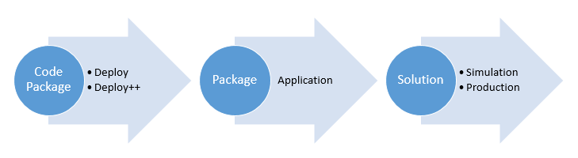

# EPM Processor Workbench

*[Retornar ao menu](README.md)*

O **EPM Processor Workbench**, ou simplesmente **Workbench**, é a interface _web_ que provê todas as funcionalidades necessárias para a criação, gerenciamento, manutenção e execução de soluções implementadas em linguagem **Python**. A figura a seguir mostra o fluxo de trabalho do **EPM Processor**.

## Acessando o Workbench

Qualquer máquina com acesso ao endereço e porta TCP/IP configurados no **EPM Processor Manager** e navegador compatível pode acessar a tela de autenticação. Utilizando a porta TCP/IP padrão do **EPM Processor**, acesse o endereço `http://nome_da_maquina:44338` no navegador.

## Usuários

O **EPM Processor** autentica seus usuários junto a um **EPM Server** previamente definido como _Master_, configurado no **EPM Processor Manager**. Qualquer usuário deste **EPM** _Master_ pode realizar o login e acessar o **Workbench**. A tabela a seguir contém as permissões dos perfis de usuário.

|Perfil|Permissões|
|---|---|
|**sa**|Este usuário tem acesso irrestrito a todos os itens|
|**Todos os demais**|Todos os outros usuários têm acesso aos itens criados por ele mesmo ou àqueles que obteve permissão através de quem o criou ou do **sa**|

## Segurança em Nível de Aplicativo

### Segurança de Código Fonte

+ Qualquer usuário tem acesso aos **Code Packages** disponíveis.
+ Para proteger o código fonte, use o **Deploy++** para criar um **Package** e então exclua o **Code Package**.
+ É de responsabilidade do usuário o armazenamento, versionamento de código e os _backups_ do código fonte.

### Segurança de Applications e Productions

É possível definir permissões para que usuários possam ou não alterar as configurações de execução dos algoritmos. Para isto, siga estes procedimentos.

1. Em uma **Application** ou **Solution**, clique em **Permissions**.
2. Na janela que se abre, selecione o usuário e altere as permissões **Read**, **Write** e **Execute**, conforme a tabela a seguir.

|Permissão|Descrição|
|---------|---------|
|**Read**|Permite visualizar a configuração|
|**Write**|Permite editar a configuração|
|**Execute**|Permite iniciar e parar a execução|

> + Por padrão, apenas o usuário **sa** e o usuário que criou a **Application** ou **Solution** têm permissões sobre estas.

## Chave de produto

O **Workbench** mostra qual é a versão da chave de produto e o seu código. Para acessar estas informações, clique em **About**.

*[Próxima Seção: EPM Connections](EPMProcessorEPMConnections.md)*
