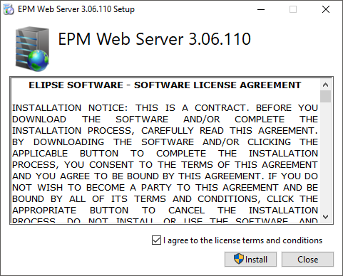
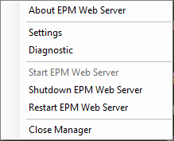
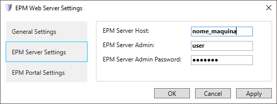

# EPM Webserver - Guia de instalação

Data:06/08/2018

Versão: 0.1

## Introdução

O **EPM Webserver** é um módulo do sistema **EPM** que provê acesso a um dado **EPM Server** através de um API RESTful.

Este módulo é pré-requisito para os seguintes módulos do sistema EPM: **EPM Portal** e **EPM Processor**.

### Pré-requisitos

* Windows 7 SP1 ou superior
* Windows Server 2008 R2 SP1 ou superior
* EPM Server 3.5 ou superior
* .NET 4.7.1 ou superior

## Instalação e Configuração

Inicie a instalação, aceitando os termos de contrato e seguindo a sequência de avançar (“Next”) até o final.

Ao finalizar a instalação o ícone do **EPM Webserver** aparecerá na bandeja do Windows.

Clique com o botão direito no ícone e escolha a opção **Settings**.

Na janela que abriu, escolha  **EPM Server Settings** e insira o endereço, usuário e senha do EPM Server, clique em **Apply** e aguarde o término da configuração.

Clique em **OK** para fechar a janela.

