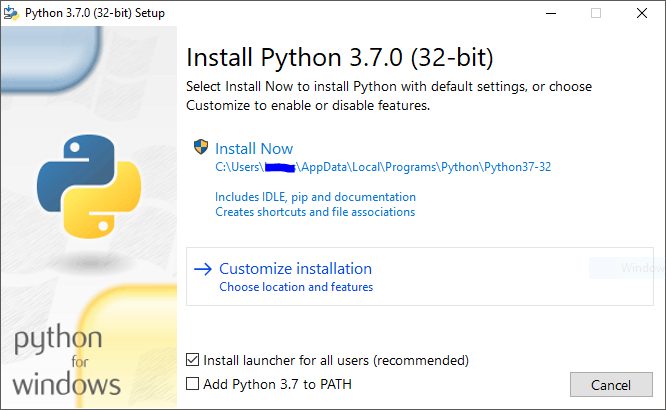

# Guia de instalação da Distribuição Python

**Data**: 02/10/2018

**Versão**: 0.1

## Pré-requisitos

+ Instalador para Windows, disponível no site da linguagem *[Python](https://www.python.org/downloads/windows/)*
+ **Windows Vista** ou superior

## Instalação

Para iniciar a instalação, clique duas vezes no arquivo de instalação. Após iniciar a instalação, há duas opções, mostradas na figura a seguir.

### Opção Install Now

Neste caso não é necessário um usuário com permissão de Administrador, a menos que seja necessário um _update_ da **C Runtime Library** ou se a opção **Install launcher for all users** estiver selecionada. A distribuição **Python** é instalada no diretório do usuário e são também instaladas as bibliotecas **Python Standard Library** e **PIP** (*Python Install Packages*). Se selecionada a opção **Add Python to PATH**, o diretório de instalação é adicionado à variavel de ambiente **PATH**.

### Opção Customize installation

Neste caso são mostradas opções para alterar o local de instalação e quais os recursos a instalar, entre outras opções. Esta opção pode requerer um usuário com permissão de Administrador. A **Standard Library** pode ser pré-compilada em _bytecode_.
