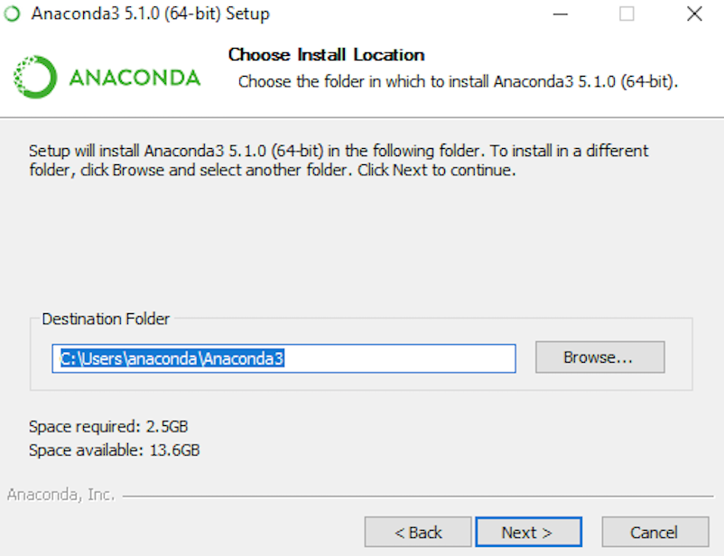
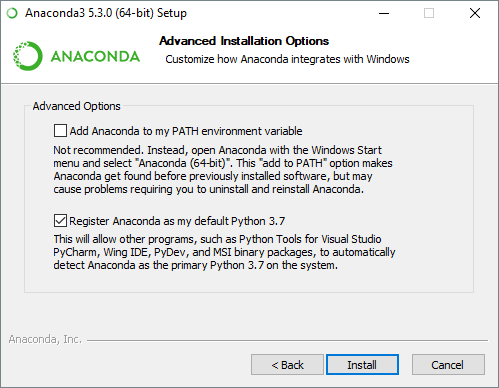
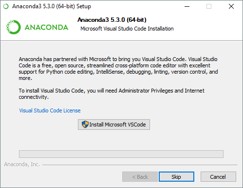

# Guia de Instalação da Distribuição Anaconda

Data: 02/10/2018

Versão: 0.1

## Pré-requisitos

+ Arquivo de instalação da distribuição *[Anaconda para Windows](https://www.anaconda.com)*
+ **Windows Vista** ou superior
+ 3 GB de espaço em disco para *download* e instalação

## Instalação

> + Para evitar erros de permissão, não execute o instalador a partir da pasta **Favoritos**.
> + Recomenda-se desabilitar qualquer antivírus antes da instalação e habilitá-lo após o término.

1. Clique duas vezes no arquivo do instalador.
2. Clique em **Next**.
3. Leia os termos de uso e clique em **I Agree**.
4. Selecione uma pasta de destino.

5. Selecione as opções **Add Anaconda to my PATH environment variable** e **Register Anaconda as my default Python 3.6**.

6. Clique em **Install**.

7. O instalador também permite a opção de instalar o **Microsoft Visual Studio Code**. Aceite apenas se deseja utilizar este editor. Senão, clique em **Skip**.

8. Clique em **Finish** para fechar a janela do instalador.
