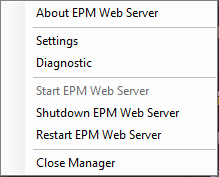
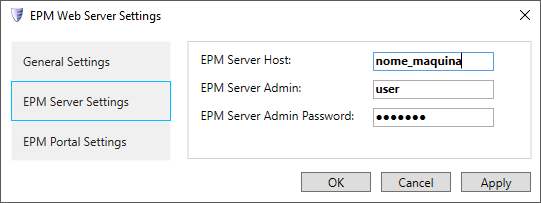

# Guia de Instalação do EPM Webserver

Data: 19/09/2018

Versão: 0.1

## Introdução

O **EPM Webserver** é um módulo do sistema **EPM** que provê acesso a um **EPM Server** através de uma API **RESTful**.

Este módulo é pré-requisito para os módulos **EPM Portal** e **EPM Processor** do sistema **EPM**.

## Pré-requisitos

* **Windows 7 SP1** ou superior
* **Windows Server 2008 R2 SP1** ou superior
* **EPM Server** 3.5 ou superior
* **Framework .NET** 4.7.1 ou superior

## Instalação e Configuração

1. Inicie a instalação aceitando os termos de contrato e seguindo a sequência de avançar (**Next**) até o final.

   

2. Ao finalizar a instalação, o ícone do **EPM Webserver** aparece na Área de Notificações do Windows.

    

3. Clique com o botão direito do mouse no ícone e selecione a opção **Settings**.

    

4. Na janela que se abre, selecione a aba  **EPM Server Settings** e digite o endereço, usuário e senha do **EPM Server**.

5. Clique em **Apply** e aguarde o término da configuração.

    

6. Clique em **OK** para fechar esta janela.

