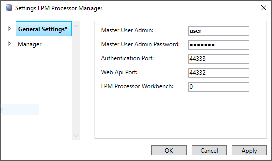
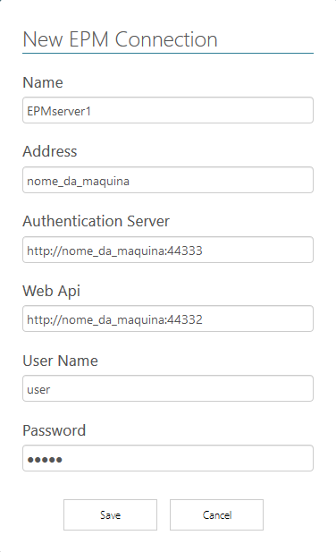
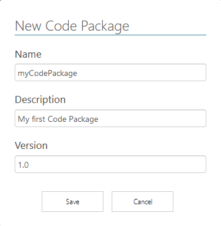
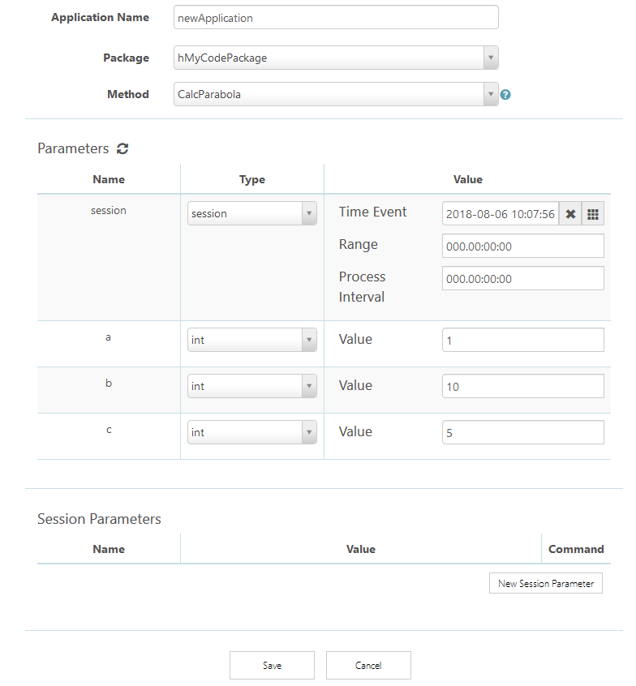
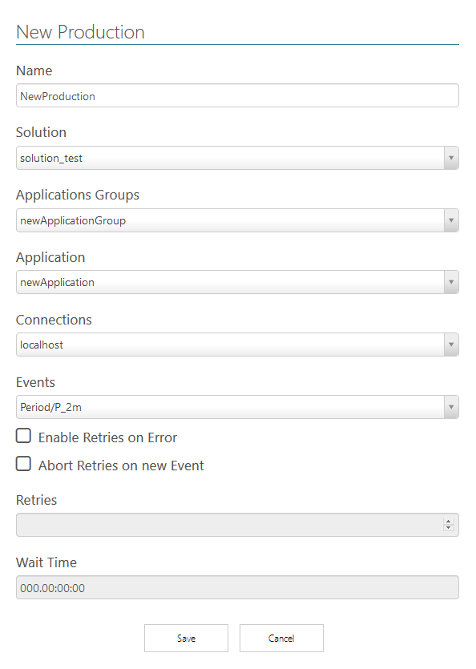
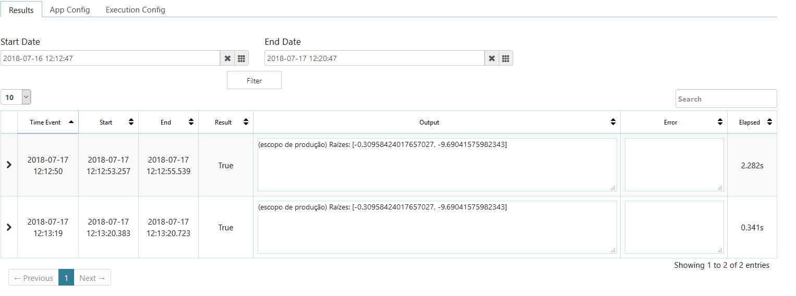

# Guia Rápido de Utilização do EPM Processor

Data: 04/12/2019

Versão do EPM Processor: 1.4

## Introdução

O **EPM Processor** é um módulo que se integra à plataforma **Elipse Plant Manager** (EPM). Através desta plataforma é possível coletar dados de diversas origens, armazená-los e contextualizá-los, oferecendo alto desempenho de gravação e consulta, além de inúmeras ferramentas para visualização e análises a fim de agilizar o processo de extração de conhecimento e no balizamento de tomadas de decisões.

O **EPM Processor** atua neste cenário possibilitando que algoritmos escritos em linguagem **Python** sejam colocados em execução automatizada ou sob demanda. As execuções automáticas são baseadas em eventos e disponibilizam conexão nativa aos dados de processo de um ou mais **EPM Servers**. Alguns casos típicos de uso desta ferramenta são cálculos de indicadores de desempenho, inferências sobre variáveis de processo, cálculos de previsões de demandas e geração de relatórios e documentação automática ou sob demanda, dentre outros.

Com essa ferramenta é possível gerenciar toda a geração de informações baseadas nos dados de processo, incorporando ou não informações de outras fontes de dados, tudo em um ambiente seguro e de fácil manutenção, requisitos vitais para a gestão das informações do negócio.

O objetivo deste guia é mostrar como criar e executar um algoritmo simples. Consulte o [**Guia do Usuário do EPM Processor**](https://github.com/elipsesoftware/epmprocessor/tree/master/guiadousuario) para uma abordagem mais completa e detalhada de todas as funcionalidades da plataforma.

## Instalação e Configuração

### Pré-requisitos

+ **Windows 7 SP1** ou superior x64
+ **Windows Server 2008 R2** ou superior x64
+ **Framework .NET** 4.7.2 ou superior
+ **Internet Information Services (IIS)** com CGI ativado. Veja como ativar [aqui](https://github.com/elipsesoftware/epmprocessor/blob/master/guiadousuario/EPMProcessorSuporte.md#como-ativar-o-cgi-no-iis-internet-information-services).
+ **EPM Server** 3.12 ou superior
+ **EPM Webserver** 3.12 ou superior instalado e configurado (*[Consulte o Guia de Instalação](EPMWebserver.md)*)
+ **Python 3.6 ou superior** x64 instalado com a opção *Install for all users*. 
+ Navegador **Firefox** ou **Chrome**
+ 1.5 GB de espaço em disco para o *download* e instalação

### Instalação

1. Execute o *download* do **EPM Processor** no *[site da Elipse Software](https://www.elipse.com.br/downloads)*.
2. Execute o instalador. 
3. Leia e aceite os termos de uso.
4. Clique em **Install**.
5. Selecione o diretório de instalação do **EPM Processor** e clique em **Next**.
6. Selecione o diretório de instalação do **MongoDB** e clique em **Next**. Recomenda-se manter o diretório padrão.
4. Informe o diretório de instalação do **Python**. Clique em **Next**.
5. Mantenha a opção relacionada ao IIS ativada, para que o instalador configure automaticamente o webserver. Caso opte por utilizar outro webserver (Apache, Nginx), é preciso configurá-lo manualmente. 

### Configuração do EPM Processor Manager

Após a instalação, o **EPM Processor Manager** está disponível na Área de Notificações do Windows.

1. Clique com o botão direito do mouse no ícone do **EPM Processor Manager**  e selecione a opção **Settings**. O **EPM Processor** autentica os usuários junto a um **EPM Server** previamente definido como *Master*.
2. Configure a conexão com o servidor *Master*. Insira os dados do **EPM Server** conforme a imagem a seguir.



## Acessando o Workbench

O **EPM Processor Workbench**, ou simplesmente **Workbench**, é a interface *web* que provê todas as funcionalidades necessárias para criação, gerenciamento, manutenção e execução de soluções implementadas em linguagem **Python**.

1. Para acessar o **EPM Processor Workbench**, abra o navegador e acesse o endereço `http://nome_maquina:44338`.
2. Execute o login com o usuário e senha.

## Criando EPM Connections

Para indicar quais **EPM Servers** disponibilizam eventos, objetos do **EPM** e estruturas de dados usados como dados de entrada ou gatilhos para execução de métodos, é preciso criar uma **EPM Connection**.

1. No menu lateral, clique em **EPM CONNECTIONS**.
2. clique em **NEW** para inserir uma nova Conexão.
3. Preencha os campos com os dados do servidor e clique em **Save**. Certifique-se que o Servidor **EPM** possui eventos configurados.



## Criando e Editando Code Packages

Um **Code Package** é um conjunto de códigos escritos em linguagem **Python** contendo as lógicas das instruções que podem ser utilizadas posteriormente nas aplicações. O **Code Package** deve ser empacotado através da operação de **Deploy** ou **Deploy++**, quando passa a ser denominado simplesmente de **Package**.

1. No menu lateral, selecione a opção **CODE PACKAGES**.
2. Na área que se abre, clique em **NEW**.
3. Digite um nome, uma descrição e a versão do **Code Package**.



Um novo **Code Package** é criado e sua interface de configuração é aberta. Nesta interface é possível inserir novos códigos ou executar o *upload* de códigos existentes (**ADD CODES**). Para fins de teste, crie um algoritmo inserindo os códigos a seguir.

1. Clique em **NEW CODE**, digite um nome e uma descrição e clique em **Save**.
2. Selecione o nome criado no passo anterior para abrir a edição do código fonte. Edite o código fonte conforme a sugestão a seguir.

```python
import epmprocessor as epr
import epmwebapi as epm

@epr.applicationMethod('CalcParabola')
def parabola_func(session, a, b, c):
    """
    Método que imprime o resultado  de uma equação de 2º grau.
    """
    if session.scopeContext == session.scopeContext.Test:
        print('(Escopo de Teste) Raízes: {}'.format(calc(a,b,c)))
    elif session.scopeContext == session.scopeContext.Production:
        print('(Escopo de Produção) Raízes: {}'.format(calc(a,b,c)))

    return epr.ScopeResult(True)

def calc(a, b, c):
    from math import sqrt
    try:
        delta = pow(b,2) - (4 * a * c)
        raiz = [(-b + sqrt(delta)) / (2 * a), (-b - sqrt(delta)) / (2 * a )]
        return raiz
    except ZeroDivisionError:
        return 'Se \'a\' é igual a zero, não há funcão quadrática, pois tem-se uma divisão por zero'
    except ValueError:
        return 'Não há raiz quadrada de números negativos no conjunto dos Reais'
```

Observe que um dos métodos possui um **Decorator**, `epr.applicationMethod`. Este é o método que é exposto para utilização nas **Applications**.

1. Clique em **Salvar** e em **Compile** para verificar se há erros de sintaxe.
2. Selecione a seção **Tests**. Selecione o método criado anteriormente na lista de seleção **Method** para carregar os parâmetros.
3. No parâmetro `session`, selecione o tipo **session** e defina qualquer data no campo **Time Event**.
4. Nos parâmetros `a`, `b` e `c`, selecione o tipo de dados **int** e digite qualquer valor inteiro nos campos **Value**.
5. Clique em **Test** para visualizar o resultado da execução deste método.

## Deploy e Application

Para executar um método em ambiente de produção é necessário executar o **Deploy** do método. Existem duas alternativas, **Deploy** e **Deploy++**. Enquanto a primeira alternativa executa um empacotamento simples de código fonte, a segunda alternativa empacota o código fonte em formato binário, de forma a oferecer maior desempenho durante as execuções, além de proteger o código fonte de visualizações (propriedade intelectual). Ambas as alternativas criam um **Package**.

1. No menu **Code Package**, clique em **Deploy**. A janela já oferece uma sugestão para o nome do **Package**. Pode-se manter esta sugestão. Clique em **Deploy** e aguarde o término do processamento.
2. No menu lateral, clique em **Packages** para confirmar a criação do **Package**.

Uma **Application** é uma configuração de como um método vai ser executado. Insere-se em uma **Application** os valores base de parâmetros para a futura execução em produção ou simulação.

1. No menu lateral, clique em **Applications**.
2. Clique em **NEW** para criar um novo grupo de **Applications**.
3. Na janela que se abre, digite um nome, uma descrição e clique em **Save**.
4. Clique em **Editar**.
5. Clique em **NEW APPLICATION**.
6. Preencha os campos conforme a imagem a seguir e clique em **Save**.



## Solutions

As **Solutions** servem para organizar as soluções implementadas sobre aplicações, que podem ser colocadas em produção (eventos em tempo real) ou simuladas (eventos simulados e executados sob demanda).

1. No menu lateral, clique em **Solutions**.
2. Clique em **NEW**.
3. Digite um nome para a **Solution** e clique em **Save**.
4. Clique em **Editar** para abrir a visualização de **Simulations** e **Productions**.
5. Em **Productions**, clique em **NEW**, preencha os campos e clique em **Save**. Utilize a **EPM Connection** criada anteriormente e um evento relacionado.



A **Production** foi criada mas ainda não está em modo **Play**. O modo **Play** corresponde ao estado onde a rotina a ser executada aguarda pela chegada de um evento que dispare o início de sua execução.

1. Para acessar o painel da **Production**, clique em **Editar**.
2. Clique em **Play** para que cada novo evento gerado no **EPM Server** dispare uma nova execução do código, ou execute novamente em caso de configurações para ocorrências de falhas.
3. Na aba **Results** pode-se verificar o resultado das execuções após executar um filtro por data e hora.



## Conclusão

Este **Guia Rápido** se propõe a mostrar os passos básicos para se colocar um método em produção. Para mais informações, entre em contato através do e-mail *[supportepm@elipse.com.br](mailto:supportepm@elipse.com.br)* ou acesse os endereços a seguir:

+ *[Site da Elipse Software](https://www.elipse.com.br)*
+ *[Canal da Elipse Software no Youtube](https://www.youtube.com/user/ElipseSoftware)*
+ *[Elipse Knowledgebase](https://kb.elipse.com.br)*
+ *[Elipse Forum](https://forum.elipse.com.br)*
