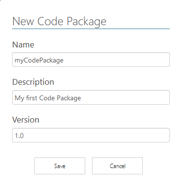
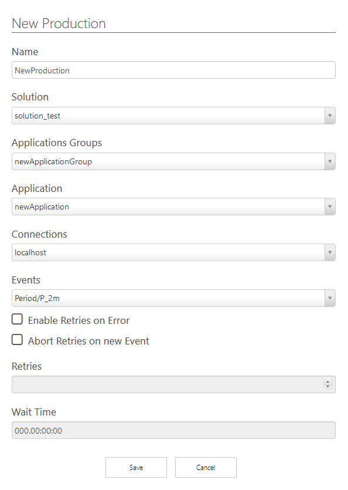

# EPM Processor Quickstart Guide

EPM Processor Version: 1.4

## Intro

**EPM Processor** is a module that integrates with the **Elipse Plant Manager** (EPM) platform. Through this platform it is possible to collect data from different sources, store and contextualize them, offering high performance of recording and query, as well as numerous tools for visualization and analysis in order to help the process of knowledge extraction and make data-based decisions.

**EPM Processor** operates in this scenario, allowing algorithms written in **Python** to be executed automatically or on demand. Automatic executions are event based and provide native connection to the process data of one or more **EPM Servers**. Some typical use cases for this tool are calculations of performance indicators, inferences about process variables, calculations of demand forecasts and generation of reports and automatic or on-demand documentation, etc.

With this tool it is possible to manage the entire generation of information based on the process data, incorporating information from other data sources, all in a safe and easy to maintain environment, vital requirements for the management of business information.

The purpose of this guide is to show you how to create and execute a simple algorithm. See the [**EPM Processor User Guide **](https://github.com/elipsesoftware/epmprocessor/tree/master/guiadousuario) for a more complete and detailed approach to all platform functionality. *Portuguese only*

## Install and Configuration

### prerequisites

+ **Windows 7 SP1** or high x64
+ **Windows Server 2008 R2** or high x64
+ **Framework .NET** 4.7.2 or high
+ **Internet Information Services (IIS)** whith activated CGI. See how to activate [here](https://github.com/elipsesoftware/epmprocessor/blob/master/guiadousuario/EPMProcessorSuporte.md#como-ativar-o-cgi-no-iis-internet-information-services).
+ **EPM Server** 3.12 or high
+ **EPM Webserver** 3.12 or high
+ **Python 3.6 or highr** x64 installed with option *Install for all users* marked.
+ Browser **Firefox** or **Chrome**
+ 1.5 GB disk space.

### Install

1. Download **EPM Processor** in our site. *[Elipse Software](https://www.elipse.com.br/downloads)*.
2. Execute the installer. 
3. Read and accept use terms.
4. Click in **Install**.
5. Select **EPM Processor** installation directory then click in **Next**.
6. Select **MongoDB** installation directory then click in **Next**. 
4. Enter the installation directory of the **Python**. Then, click in **Next**.
5. Keep the IIS option enabled. Then, click in **Next**.
6. Wait the finish. This process may take a few minutes.

### EPM Processor Manager Configuration

After intallation the **EPM Processor Manager** are avaiable in Windows notification area. 

1. Click with left button on **EPM Processor Manager**  and select  **Settings**. **EPM Processor** authenticates users in **EPM Server**. Here we define this EPM Server as *Master*.
2. Config the *Master*. 


## Workbench

**EPM Processor Portal Workbench**, or simply **Workbench**, is a *web* interface to create, manage and maintenance solutions created with   **Python** language.

1. To access the **EPM Processor Workbench**, open Browser: `http://machine_name:44338`.
2. Make login with *Master* user.

## EPM Connections

To indicate what **EPM Server**  make avaiable *Events*, **EPM** Objects and data, we need to create an  **EPM Connection**.

1. In left Menu, click in **EPM CONNECTIONS**.
2. click in **NEW** to insert a New Connection.
3. Configure the fields with the server data and click **save**. Make sure that the **EPM** Server has events configured.


## Create and Edit Code Packages

**Code Package** is a set of codes written in **Python** language containing the logic and instructions that can be used later in the applications. The **Code Package** must be packaged through the **Deploy** or **Deploy ++** operation, when it is simply called **Package **.

1. In the left menu select **CODE PACKAGES**.
2. Click in **NEW**.
3. Configure name, description and version of **Code Package**.



The new **Code Package** was created and its configuration interface was opened. In this interface it is possible to insert new codes or perform upload of existing codes (**ADD CODES **). For testing purposes, create an algorithm by entering the following codes.

1. Click in **NEW CODE**, configure name and description then click in **Save**.
2. Select the name created in the previous step to open the source code edit. Edit the source code as suggested below.

```python
import epmprocessor as epr
import epmwebapi as epm

@epr.applicationMethod('CalcFunction)
def parabola_func(session, a, b, c):
    """
    Prints results from a 2nd degree function.
    """
    if session.scopeContext == session.scopeContext.Test:
        print('(Test Scope) Raízes: {}'.format(calc(a,b,c)))
    elif session.scopeContext == session.scopeContext.Production:
        print('(Production Scope) Raízes: {}'.format(calc(a,b,c)))

    return epr.ScopeResult(True)

def calc(a, b, c):
    from math import sqrt
    try:
        delta = pow(b,2) - (4 * a * c)
        root = [(-b + sqrt(delta)) / (2 * a), (-b - sqrt(delta)) / (2 * a )]
        return root
    except ZeroDivisionError:
        return 'Division by zero'
    except ValueError:
        return 'There is no square root'
```

Note that one of the Python methods has an **Decorator**, called `epr.applicationMethod`. This decorator is the key to expose a Python method to be used in an **Application**.

1. Click in **Save** then in **Compile** to verify sintaxe errors.
2. In  **Tests** section. Select the CalcFunction **Method** to load parameters.
3. In `session` parameter, select the **session** type then choose any date in field **Time Event**.
4. in `a`, `b` and `c` parameters, select the **int** data type then insert an integer **Value**.
5. Click in **Test** to visualize the results.

## Deploy and Application

To execute a method in a production environment it is necessary to execute the **Deploy** of the method. There are two alternatives: **Deploy** and **Deploy ++**. While the first alternative performs a simple packaging of source code, the second alternative packages the source code in binary format, in order to offer greater performance during executions, in addition to protecting the source code from visualizations (intellectual property). Both alternatives creates a **Package**.

1. From the **Code Package** menu click in **Deploy**. The window already offers a suggestion for the name of the **Package**. This suggestion can be maintained. Click **Deploy** and wait for processing to finish.

An **Application** is a configuration of how a method will be executed. The default values of parameters for execution in production or simulation are inserted in an **Application**.

1. In left menu click in **Applications**.
2. Click in **NEW** to create a new **Applications** group.
3. Config name and description then click in **Save**.
4. Click in **Edit**.
5. Click in **NEW APPLICATION**.
6. Config fields like image below and **Save**.


## Solutions

**Solutions** are used to organize the execution of the Applications, which can be put into production (real-time events) or simulated (simulated events and executed on demand).

1. In left menu click in **Solutions**.
2. Click in **NEW**.
3. Config the **Solution** name then click in **Save**.
4. Click in **Edit** to open **Simulations** and **Productions** visualization.
5. In **Productions**, click in **NEW**, config the fields then click in **Save**. Use the **EPM Connection** with an Event.



The **Production** has been created but is not yet in **Play** mode. **Play** mode corresponds to the state where the routine to be executed waits for the arrival of an event that triggers the start of its execution.

1. To access the **Production** panel, click in **Edit**.
2. Click in **Play**.
3. In results **Results** you can check the result of the executions after running a filter by date and time.


## Conclusion

This **Quickstart Guide** show the basic steps to put a method into production. For more information, contact us by email *supportepm@elipse.com.br](mailto:supportepm@elipse.com.br)* or access:

+ *[Elipse Software site](https://www.elipse.com)*
+ *[Youtube Channel](https://www.youtube.com/user/ElipseSoftware)*
+ *[Elipse Knowledgebase](https://kb.elipse.com.br)*
+ *[Elipse Forum](https://forum.elipse.com.br)*
